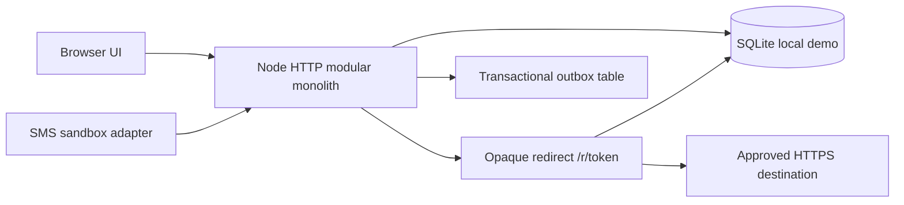

# Architecture and decisions

## Current executable data flow

The API owns Organizations/Sessions, Marketplace, Campaigns, Booking, Tracking, Conversion, SMS permissions/messages, Reporting, and Finance tables in one SQLite file. Each financial or state transition uses `BEGIN IMMEDIATE` and an audit row. Outbox rows are written for key changes, but **there is no worker consuming them**. That is a production blocker. API query results are bounded to 100 rows where listing applies. Redirect writes are synchronous and a failed event write does not block the redirect; the failure is logged, but loss metrics and durable retry are not implemented.

## ADR-001: local foundation instead of pretending production infrastructure

The requested Next.js, NestJS, PostgreSQL, Redis, S3, ClickHouse, and worker services could not be established and verified as a complete production stack in this build. The current system uses a dependency-free Node HTTP server, SQLite, and static code-native web UI to make the core workflow runnable and testable. This is a deliberate **sandbox implementation choice**, not a production architecture recommendation. Moving to PostgreSQL is required before scale or real money, with transaction and tenant-isolation tests rerun. A queue worker, analytical store, object storage, and deployment hardening remain separate gates.

## ADR-002: tenant boundary

Sessions map to a user with exactly one organization in this demo. Every campaign, booking, report, ledger, invoice, and conversion operation applies server-side organization scope or operator role. The tests create a second advertiser and verify empty lists plus 404 for a foreign invoice/conversion. Multi-organization memberships, scoped API keys, RLS, and asset downloads do not exist yet.

## ADR-003: money truth

All amounts are safe integer minor units plus ISO currency code. A reservation posts advertiser available `-price` and booking escrow `+price`. Settlement posts escrow `-price`, owner payable `+85%`, platform fee `+15%`; the owner organization also records a balanced receivable/clearing pair. These entries are **sandbox accounting examples**, not an agreed commercial rate. The unique `(org, reference, account)` key and state machine prevent repeated settlement. No provider payment reconciliation, taxes, FX, chargebacks, or payout transfer exists.

## ADR-004: measurement and attribution

Token generation uses 24 random bytes in URL-safe form. Destinations must be HTTPS and match `ALLOWED_DESTINATION_HOSTS`; no user credentials are allowed in a URL. The redirect records only a platform-observed click, excluding HEAD and common bot/prefetch hints. It collects no IP-derived identity. Conversion imports have advertiser scope and unique event IDs. Reports state source and denominator; they do not present a causal attribution model. Event timestamps are UTC. The simplistic bot filter is insufficient for production fraud controls.

## Target boundaries before production

| Context | Owned production data and failure boundary |
|---|---|
| Identity/Organizations | Memberships, MFA, sessions, API keys, audit; account takeover and cross-tenant denial |
| Marketplace/Inventory | Property ownership evidence, SKU contracts and availability; verification freshness and overlap |
| Campaigns/Creatives | Briefs, approvals, creative assets and policy cases; unsafe content/takedown |
| Booking/Fulfillment | Reservation, acceptance, publication evidence, dispute and make-good; stale reservation and missing proof |
| Messaging/Routing | Permission ledger, templates, sender identity, outbox jobs, callbacks; duplicate send/opt-out race |
| Web ad delivery | Slot registry, eligibility, pacing and viewability; no-fill and overspend |
| Tracking/Events | Redirect, SDK and conversion API; loss, replay and clock skew |
| Identity/Attribution | Evidence-bearing edges, reversals and model versions; false merges |
| Reporting | Aggregates with source and freshness; late/corrected data |
| Finance | Balanced immutable ledger, provider reconciliation and payout holds; duplicate or mismatched money |
| Trust/Support | Cases, appeal and operator override; abuse and audit gaps |

Production events should use a versioned envelope with event ID, tenant ID, occurred/received times, actor, source, schema version and trace ID. Use transactional outbox/inbox with idempotent consumers, dead-letter queue, replay control and lag metrics. The present outbox is a schema foothold only.
